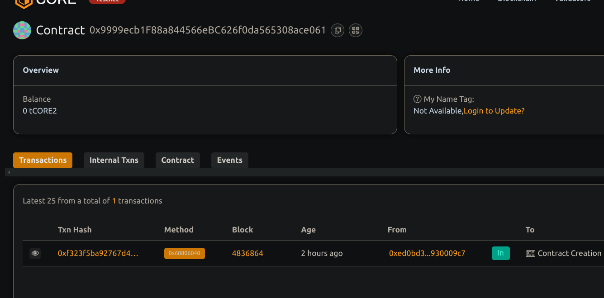

bh# Token-based Quiz  Trivia Game with Rewards

## Project Description
A decentralized quiz game smart contract where player answer questions and earn ERC20 token reward correct answer. The contract manage question, rewards distribution, and allow users withdraw their accumulated token reward.

## Project Vision
To create an engaging and rewarding decentralized trivia experience, incentivizing knowledge to sharing s and learning with token-based incentive onn blockchain.

## Key Features
- Owner can add multiple choice questions with are correct answers
- Players answer questions and earn token reward for correct response
- Players can withdraw their accumulated token rewards anytime
- Owner can fund the contract with reward tokens to maintain payout
- Transparent and verifiable reward system

## Future Scope
- Support for timed quizzes and leaderboards
- Integration with NFT badges for high scorers
- Multi-language question support
- Frontend UI for interactive quizzes
- Support for multiple token rewards or fiat on/off ramps

## Contract details
0x9999ecb1F88a844566eBC626f0da565308ace061
